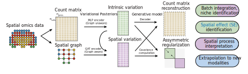

# SIMVI

SIMVI (Spatial Interaction Modeling using Variational Inference) is a deep generative framework for disentangling intrinsic variation and spatially-induced variation in spatial omics data. SIMVI has rigorous identifiability guarantee, and enables novel downstream analyses, including clustering and differential expression analysis based on disentangled representations, spatial effect identification, spatial effect attribution, and transfer learning on new measurements / modalities. SIMVI is implemented with scvi-tools.

Read our updated preprint on BioRxiv:
https://www.biorxiv.org/content/10.1101/2023.08.28.554970v3
## System requirements
### OS requirements
The SIMVI package is supported for all OS in principle. The package has been tested on the following systems:
* macOS: Monterey (12.4)
* Linux: Ubuntu (20.04.5)
### Dependencies
See `setup.cfg` for details.

## Installation
SIMVI requires `python` version 3.7+.  Install directly from pip with:

    pip install simvi

The installation should take no more than a few minutes on a normal desktop computer.

## Usage

For detailed usage, follow our step-by-step tutorial here. The tutorial should take no more than 30 minutes to complete on a standard desktop computer.

- [Getting Started with SIMVI](https://github.com/KlugerLab/SIMVI/blob/main/SIMVI_tutorial_MERFISH.ipynb)

Download the dataset used for the tutorial here:

- [Human MERFISH MTG data](https://drive.google.com/drive/folders/1jeAZge-0wJ1gkHEKC4P6PIalumn2A68p?usp=sharing)
